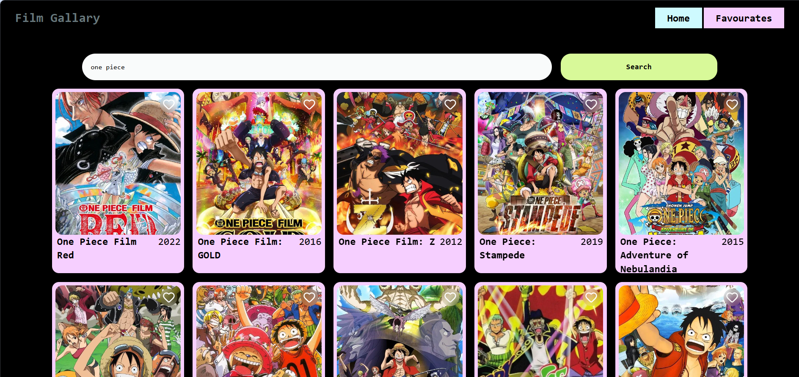
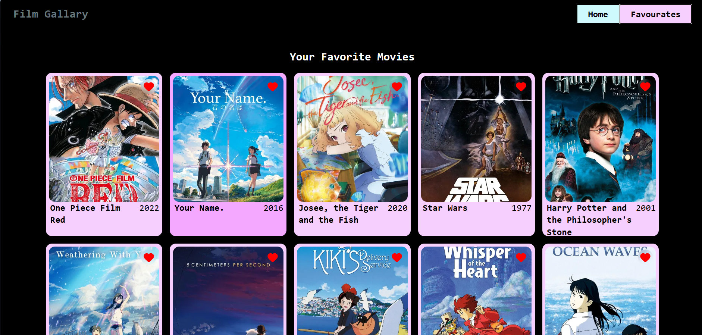

# Film Gallery 🎬

A modern, responsive movie discovery application built with React.js that allows users to browse popular movies, search for their favorites, and maintain a personal favorites list using persistent local storage.

## 🚀 Purpose of the Project
I built this project to revitalize and solidify my knowledge of:
- **React.js**: Deep diving into component architecture and state management.
- **Hooks**: Mastering `useState` and `useEffect` for data fetching and side effects.
- **Context API**: Implementing global state management without prop-drilling.
- **API Integration**: Working with real-world movie data from TMDB.

## 🧠 What I Learned: The Context Hook
The core of this project was mastering the **Context Hook (`useContext`)**. Here's a breakdown of my learning:
- **Global State Management**: I learned how to create a centralized store for "Favorites" that is accessible from any component (like the Movie Card or the Favorites Page) without passing props through multiple levels.
- **Provider & Consumer Pattern**: Setting up a `MovieProvider` to wrap the application and creating a custom `useMovieContext` hook for a cleaner, more intuitive component API.
- **Data Persistence**: Leveraging `useEffect` within the context to sync global state with `localStorage`, ensuring the user's data persists even after a page refresh.

## ✨ Features
- **Live Search**: Find any movie instantly.
- **Favorites System**: Bookmark movies you love.
- **Persistent Data**: Your favorites stay saved in your browser.
- **Responsive Design**: Looks great on all screen sizes.

## 🛠️ Built With
- **React.js**
- **Lucide React** (for icons)
- **Tailwind CSS** (for styling)
- **TMDB API** (for movie data)

## 📸 Screenshots

## 🚦 Getting Started
1. Clone the repository
2. Run `npm install`
3. Start the dev server with `npm run dev`

---
*Created with ❤️ to master the art of React hooks.*
